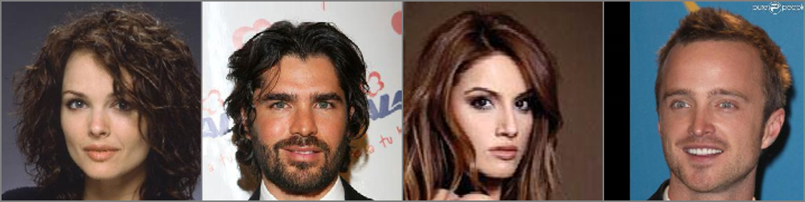
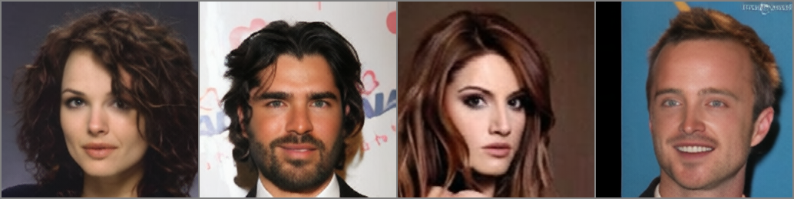
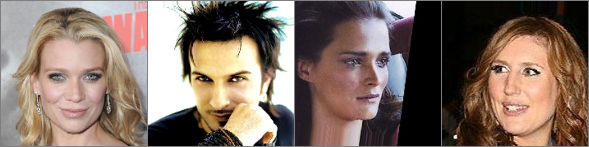
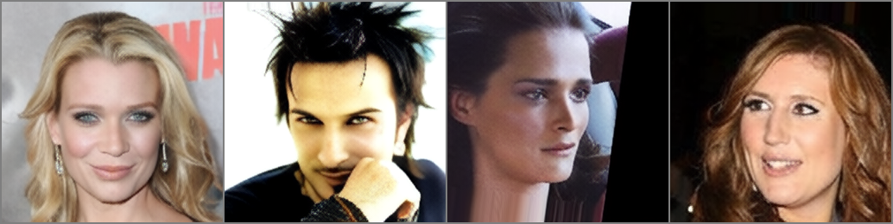

# TextArtT5: Multimodal Text-to-Image with Discrete Latent Space

This project is an ongoing effort to build a Text-to-Image generation system based on an **Autoregressive Transformer** architecture combined with an **EMA VQGAN**.

> **IMPORTANT NOTICE REGARDING SOURCE CODE & PRE-TRAINED WEIGHTS:**
> This project is currently in the active training and fine-tuning phase. At present, this repository **only hosts the baseline source code and basic architectural implementations** to demonstrate the core pipeline.
> The finalized and fully-featured repository featuring our **advanced architectural enhancements** and the complete pre-trained weights for both the VQGAN and T5 models will be fully open-sourced once the project reaches completion. Please refer to the [Roadmap](#-roadmap) below.
---

## System Overview

The system is designed in 2 main stages:

### Stage 1: Image Quantization (EMA VQGAN)
* **Discrete Latent Representation:** Compresses high-dimensional continuous image data into a discrete latent space (codebook), framing the image generation task as a sequence-to-sequence problem.
* **Image Reconstruction:** Trains an encoder-decoder architecture to accurately reconstruct images from their discrete token representations.

### Stage 2: Autoregressive Generation (TextArt-T5)
* **T5 Architecture:** Conditions the image token generation process directly on text prompts using a robust sequence-to-sequence structure.
* **Text Tokenization:** Leverages the pre-trained **Qwen2 Tokenizer** to ensure highly efficient text representation and robust multi-lingual/special token handling.
* **Token Modeling & Perturbation:** Learns to predict the next image token autoregressively while leveraging an in-place, memory-efficient token dropout (perturbation) to boost inference robustness.
* **KV Cache Support:** Fully supports Key-Value (KV) Caching during inference to eliminate redundant computations, accelerating generation speed and significantly reducing latency per token.
---

## Model Zoo

### Stage 1: Image Quantization Models
| Model Name        | Parameters | Link |
|:------------------|:-----------| :--- |
| EMA-VQGAN-f8-1024 | 151M       | Coming Soon (Upon Completion) |
| EMA-VQGAN-f8-8192 |        | Coming Soon (Upon Completion) |


### Stage 2: Autoregressive T5 Models
| Model Name     | Parameters | Link |
|:---------------| :--- | :--- |
| TextArtT5-1.6B | 1.6B | Coming Soon (Upon Completion) |

## Reconstruction Showcase

Currently, the **Stage 1 (VQGAN)** model can stably compress and decode (reconstruct) images. Below are some validation and training reconstruction results generated directly from our trained codebook.

*(Left: Original Input Image | Right: Reconstruction)*

<div align="center">
  
  
  <br/>
  <i>Validation Sample (ID: 2816)</i>
  <br/><br/>
  
  
  <br/>
  <i>Training Sample (ID: 2794)</i>
</div>

> **Note:** These are pure reconstruction tests from Stage 1 and do not yet represent the final Text-to-Image generation capabilities of the Stage 2 Transformer.
---
## Setup and Installation
```bash
pip install -r requirements.txt
```


**Download the Dataset:** You can download the official CelebA-Dialog dataset used for training this project directly from Kaggle:
    [Download Dataset Here](https://www.kaggle.com/datasets/trungnguyenai/celeba-dialog)


## How to Run

### 1. Train Stage 1 (EMA VQGAN)
To train the VQGAN model to reconstruct your dataset images into discrete codebook indices:
```bash
python train_vqgan.py --config config/vqgan_config.yaml
```

### 2. Train Stage 2 (Autoregressive Transformer)
Once Stage 1 is fully trained, freeze the VQGAN encoder and train the conditional T5 generator:
```bash
python train_cond_trans.py --config config/ar_config.yaml
```

---

## Roadmap

- [x] Design and implement the VQGAN architecture.
- [x] Finalize the VQGAN training pipeline (Stage 1).
- [x] Open-source the foundational architecture and training logic.
- [x] Finalize the T5 training pipeline (Stage 2).
- [ ] Complete large-scale training on comprehensive datasets.
- [ ] **Release Pre-trained Weights for the VQGAN.**
- [ ] **Release Pre-trained Weights for the Text-to-Image T5.**
- [ ] Provide inference scripts and generation pipelines.

---

## Acknowledgments

This project is built upon the inspiration and technical concepts from:
* [Taming Transformers (VQGAN)](https://github.com/CompVis/taming-transformers)
* The Qwen Team (Alibaba Cloud) for their advanced tokenizer implementation.
* The architectural foundations of the Google T5 families.

---
*If you find this project interesting, please leave a ⭐️ (Star) and come back when the weights are officially released!*
